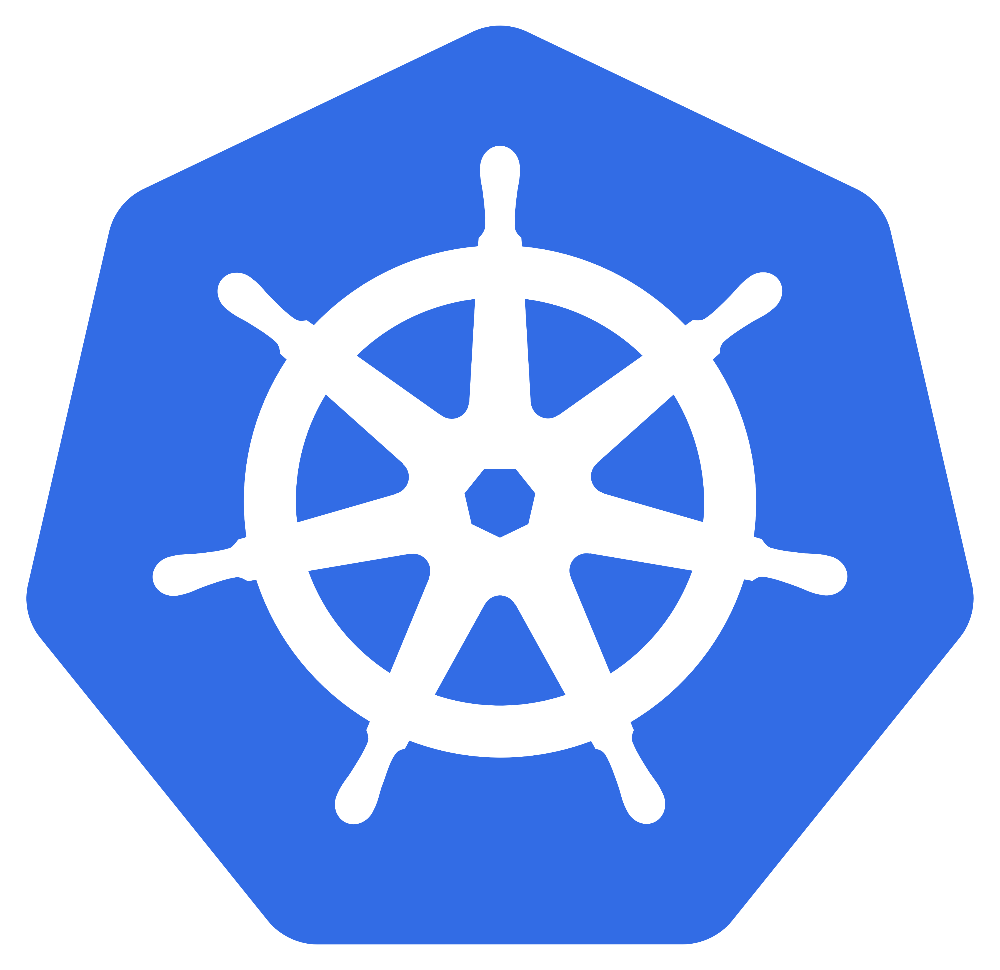
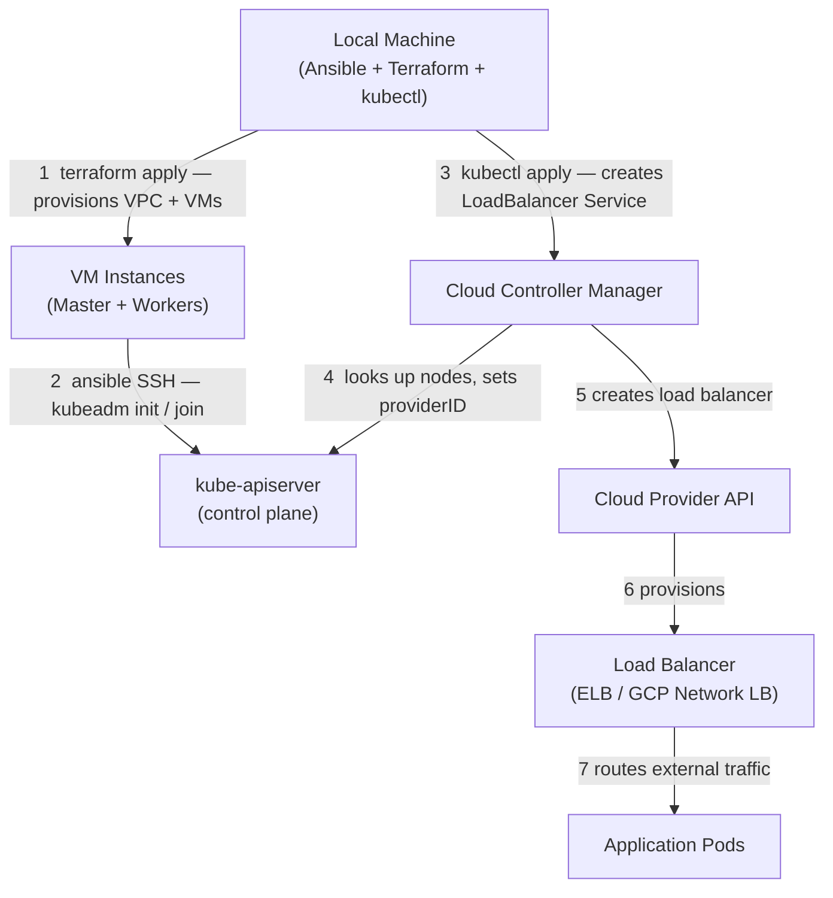
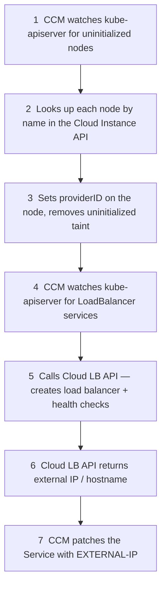
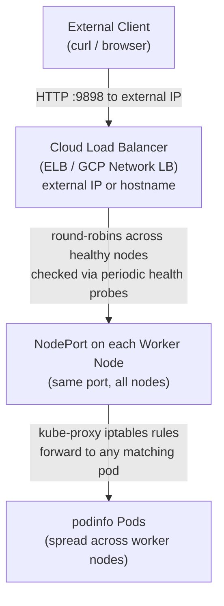

# easy-kubeadm-k8s-cluster

<p align="center">
  
</p>

Provision a Kubernetes cluster on AWS or GCP using **Terraform** for infrastructure
and **Ansible + kubeadm** for cluster bootstrap.

This project automates:

- Cloud infrastructure provisioning (VPC, subnets, security groups/firewalls, instances)
- Kubernetes installation via kubeadm
- Container runtime configuration (containerd)
- Cluster bootstrap and kubeconfig retrieval
- Optional teardown of all infrastructure

---

## Table of Contents

- [Why This Project Exists](#why-this-project-exists)
- [How It Works (High Level)](#how-it-works-high-level)
- [Architecture Overview](#architecture-overview)
- [Prerequisites](#prerequisites)
  - [Operating System](#operating-system)
  - [Required Tools](#required-tools)
  - [Cloud Credentials](#cloud-credentials)
- [Installation](#installation)
  - [Clone the repository](#clone-the-repository)
  - [Set up a Python virtual environment](#set-up-a-python-virtual-environment)
  - [Install Python and Ansible dependencies](#install-python-and-ansible-dependencies)
- [Configuration](#configuration)
- [A Note on `GODEBUG=preferIPv4=1`](#a-note-on-godebugpreferipv41)
- [Provision Infrastructure](#provision-infrastructure)
  - [Confirm Cloud Inventory](#confirm-cloud-inventory)
- [Bootstrap Kubernetes](#bootstrap-kubernetes)
- [Set the KUBECONFIG Environment Variable](#set-the-kubeconfig-environment-variable)
- [Install Cloud Controller Manager](#install-cloud-controller-manager)
  - [How the CCM Works](#how-the-ccm-works)
  - [Prerequisites (already handled for you)](#prerequisites-already-handled-for-you)
  - [CCM Versions](#ccm-versions)
  - [Run](#run)
  - [Verify](#verify)
- [Test Deployment with podinfo](#test-deployment-with-podinfo)
  - [Traffic Flow](#traffic-flow)
  - [Deploy](#deploy)
  - [Check the assigned LoadBalancer IP](#check-the-assigned-loadbalancer-ip)
  - [Access the deployment](#access-the-deployment)
  - [Confirm load balancing](#confirm-load-balancing)
- [Teardown](#teardown)
- [Notes & Best Practices](#notes--best-practices)
- [License](#license)

---

## Why This Project Exists

This repository provides a simple, reproducible way to stand up a real
kubeadm-based Kubernetes cluster in the cloud without relying on managed
Kubernetes services.

It is ideal for:

- Learning kubeadm internals
- Demonstrations and workshops
- CI experimentation
- Infrastructure automation examples
- Extending into larger demo environments

---

## How It Works (High Level)

You don't need to be an Ansible or Terraform expert to use this project. Here's what happens under the hood when you run the playbooks:

1. **Terraform** (called by Ansible automatically) creates cloud infrastructure: a VPC, subnet, firewall rules, and VM instances.
2. **Ansible** SSHs into those VMs and installs Kubernetes using `kubeadm`.
3. **kubeadm** initializes the control plane on the master node and joins the worker nodes.
4. The **kubeconfig** is copied back to your local machine so you can use `kubectl` immediately.

You run three commands total. Everything else is automated.

---

## Architecture Overview



---

# Prerequisites

## Operating System

This project must be run from a **Linux or macOS** machine. Windows is not supported. If you are on Windows, use WSL2 with Ubuntu.

## Required Tools

Install the following on your local machine before proceeding:

| Tool | Purpose | Install guide |
|------|---------|---------------|
| Python 3.9+ | Runs Ansible | [python.org](https://www.python.org/downloads/) |
| Ansible | Orchestrates everything | Installed via pip (see below) |
| Terraform >= 1.5 | Provisions cloud infrastructure | [developer.hashicorp.com](https://developer.hashicorp.com/terraform/install) |
| `kubectl` | Interacts with your cluster | [kubernetes.io](https://kubernetes.io/docs/tasks/tools/) |
| `aws` CLI or `gcloud` CLI | Cloud authentication | See below |

## Cloud Credentials

### AWS

Configure your AWS credentials:

```bash
aws configure
```

This writes credentials to `~/.aws/credentials`. The playbooks read from there by default.

> **Permissions required:** Your AWS IAM user or role must have permissions to create and manage EC2 instances, VPCs, security groups, IAM roles and instance profiles, and Elastic Load Balancers. An account with `AdministratorAccess` covers everything. For a least-privilege setup you'll need policies covering the EC2, VPC, IAM, and ELB APIs — the exact policy is outside the scope of this README.

### GCP

Authenticate with Application Default Credentials (ADC). Run this once before provisioning:

```bash
gcloud auth application-default login \
  --scopes="openid,https://www.googleapis.com/auth/userinfo.email,https://www.googleapis.com/auth/cloud-platform"
```

This creates a credential file that Terraform and Ansible will automatically use — no service account key file required.

> **Permissions required:** Your GCP account must have permissions to create Compute Engine instances, VPCs, firewall rules, IAM service accounts, and manage project-level IAM policy bindings. The `Owner` or `Editor` role covers all of this. For a least-privilege setup you'll need roles covering Compute Engine, IAM, and Service Account administration — the exact role set is outside the scope of this README.

---

# Installation

## Clone the repository

```bash
git clone https://github.com/michaelford85/easy-kubeadm-k8s-cluster.git
cd easy-kubeadm-k8s-cluster
```

## Set up a Python virtual environment

Using a virtual environment keeps the project's Python dependencies isolated from anything else on your system, preventing version conflicts.

```bash
# Create the virtual environment inside the repo directory
python3 -m venv ./venv

# Activate it (you'll need to do this each time you open a new terminal)
source ./venv/bin/activate
```

Your prompt will change to show `(venv)` when the environment is active. All subsequent `pip` and `ansible` commands will use this isolated environment.

## Install Python and Ansible dependencies

```bash
pip install -r requirements.txt
ansible-galaxy install -r requirements.yml
```

`requirements.txt` intentionally specifies no version pins — pip will install the latest compatible versions of each package. If you already have some of these packages installed in your virtual environment, pip will reuse them.


---

# Configuration

`vars/default-vars.yml` contains all configurable parameters with documentation. Copy it to `vars/custom-vars.yml` and edit that file — the playbooks automatically prefer `custom-vars.yml` if it exists:

```bash
cp vars/default-vars.yml vars/custom-vars.yml
```

Key variables to set before running anything:

```yaml
# Where SSH keys, kubeconfig, and Terraform state are stored on your local machine.
# Default is /tmp — files there are lost on reboot. Change to a persistent path if needed.
working_dir: /tmp

cloud_provider: aws_ec2  # or gcp
cloud_prefix: kubeadm-cluster  # prefix added to all cloud resource names

# Kubernetes
kubernetes_version: '1.34'
num_instances: 2  # number of worker nodes (not counting the master)
kubernetes_allow_pods_on_master: no
instance_size: large

# AWS
aws_local_credentials_file: "~/.aws/credentials"
aws_credential_profile: "default"
ec2_region: us-east-2
# IMPORTANT: ec2_image_id is an AMI ID and is region-specific.
# The default below is Ubuntu 22.04 in us-east-2.
# If you change ec2_region, you must also update ec2_image_id to a valid AMI in that region.
# Find Ubuntu 22.04 AMIs at: https://cloud-images.ubuntu.com/locator/ec2/
ec2_image_id: ami-0503ed50b531cc445
ec2_vpc_cidr: "192.168.0.0/16"
ec2_vpc_subnet: "192.168.0.0/20"
aws_instance_username: ubuntu
aws_ccm_version: "v1.34.0"

# GCP
gcp_project: your-project-id
gcp_region: us-central1
gcp_zone: us-central1-a
gcp_disk_image: projects/ubuntu-os-cloud/global/images/family/ubuntu-2204-lts
gcp_instance_username: ubuntu
gcp_ccm_version: "v34.2.0"
```

Full annotated example:

```yaml
---
# Directory where SSH keys, kubeconfig, and Terraform state are stored locally.
working_dir: /tmp

# Cloud provider to deploy to. Acceptable values: aws_ec2, gcp
cloud_provider: aws_ec2

# Prefix added to the names of all provisioned cloud resources
# (instances, firewalls, security groups, etc.)
cloud_prefix: kubeadm-cluster

# Number of Kubernetes WORKER nodes to create.
# Set to 0 and set kubernetes_allow_pods_on_master to "yes" for a single-node cluster.
num_instances: 4

# Whether to allow pods to run on the master/control-plane node.
# Useful for single-node clusters to save on cloud costs.
kubernetes_allow_pods_on_master: no

# Instance size for worker nodes. Valid values:
#   large  → AWS: t3.large   / GCP: e2-standard-2
#   xlarge → AWS: t3.xlarge  / GCP: e2-standard-4
instance_size: large

# Disk sizes in GB
cloud_master_volume_size: 50
cloud_worker_volume_size: 100

##### Kubernetes settings #####

# Kubernetes version to install (format: 1.XX)
# See https://kubernetes.io/releases/ for available versions.
kubernetes_version: '1.34'
kubernetes_version_kubeadm: "v{{ kubernetes_version }}.0"

kubernetes_kubeadm_kubelet_config_file_path: '/etc/kubernetes/kubeadm-kubelet-config.yaml'

kubernetes_pod_network:
  cni: "calico"
  cidr: '10.0.40.0/24'

kubernetes_calico_manifest_file: "https://raw.githubusercontent.com/projectcalico/calico/v3.31.3/manifests/calico.yaml"

kubernetes_join_command_extra_opts: "--ignore-preflight-errors=Port-10250"
kubernetes_ignore_preflight_errors: "all"

##### AWS-specific parameters #####

aws_local_credentials_file: "~/.aws/credentials"
aws_credential_profile: "default"
ec2_region: us-east-2
ec2_image_id: ami-0503ed50b531cc445  # Ubuntu 22.04 in us-east-2
ec2_wait: yes
ec2_vpc_subnet: "192.168.0.0/20"
ec2_vpc_cidr: "192.168.0.0/16"
aws_instance_username: ubuntu
```

---

# A Note on `GODEBUG=preferIPv4=1`

You will see `GODEBUG=preferIPv4=1` prepended to Ansible commands throughout this guide. Here's why:

Ansible and Terraform are written in Go (or call Go binaries). On many modern Linux and macOS systems, Go programs prefer IPv6 when both IPv4 and IPv6 are available. This can cause SSH connections to cloud instances — which typically only have IPv4 addresses — to fail or time out.

Setting `GODEBUG=preferIPv4=1` forces Go's network resolver to prefer IPv4 addresses. It applies only to the single command it prefixes and has no lasting effect on your system.

**When to use it:** Prepend it to any `ansible-playbook` command in this guide. If your system is IPv4-only you can omit it, but it never hurts to include it.

---

# Provision Infrastructure

After configuring your variables, provision your cloud instances:

```bash
GODEBUG=preferIPv4=1 ansible-playbook provision-kubeadm-cluster.yml
```

This playbook runs Terraform to create:
- A VPC and subnet
- Firewall/security group rules (SSH restricted to your current IP)
- The master and worker VM instances
- An SSH key pair (saved to `working_dir`)

## Confirm Cloud Inventory

Verify that Ansible can see the newly provisioned instances by querying the dynamic inventory. Ansible's dynamic inventory reads directly from the cloud API — no manual host files needed.

```bash
# AWS
ansible-inventory -i k8s.aws_ec2.yml --graph

# GCP
ansible-inventory -i k8s.gcp.yml --graph
```

Example output:

```
# AWS
@all:
  |--@ungrouped:
  |--@aws_ec2:
  |  |--kubeadm-cluster-master
  |  |--kubeadm-cluster-worker-1
  |  |--kubeadm-cluster-worker-4
  |  |--kubeadm-cluster-worker-3
  |  |--kubeadm-cluster-worker-2
  |--@k8s_master:
  |  |--kubeadm-cluster-master
  |--@k8s_node:
  |  |--kubeadm-cluster-worker-1
  |  |--kubeadm-cluster-worker-4
  |  |--kubeadm-cluster-worker-3
  |  |--kubeadm-cluster-worker-2

# GCP
@all:
  |--@ungrouped:
  |--@k8s_master:
  |  |--kubeadm-cluster-master-1
  |--@k8s_node:
  |  |--kubeadm-cluster-worker-1
  |  |--kubeadm-cluster-worker-2
  |  |--kubeadm-cluster-worker-3
  |  |--kubeadm-cluster-worker-4
```

---

# Bootstrap Kubernetes

Now that the instances are provisioned, install Kubernetes on them. The `bootstrap-kubeadm-cluster.yml` playbook will:

- Install the containerd container runtime on all nodes
- Install the Kubernetes components (`kubelet`, `kubeadm`, `kubectl`) on all nodes
- Run `kubeadm init` on the master node to initialize the control plane
- Run `kubeadm join` on all worker nodes
- Copy the kubeconfig file from the master node to your local workstation

Pass the dynamic inventory file for your cloud provider:

```bash
# AWS
GODEBUG=preferIPv4=1 ansible-playbook bootstrap-kubeadm-cluster.yml -i k8s.aws_ec2.yml

# GCP
GODEBUG=preferIPv4=1 ansible-playbook bootstrap-kubeadm-cluster.yml -i k8s.gcp.yml
```

The bootstrap process takes **2–4 minutes** to complete.

# Set the KUBECONFIG Environment Variable

Once bootstrap completes, tell `kubectl` where your new cluster's config file is. The file is written to `working_dir` (default: `/tmp`) using your `cloud_prefix` as the name:

```bash
export KUBECONFIG=/tmp/kubeadm-cluster-config
```

Alternatively, copy it to the default location `~/.kube/config` so `kubectl` picks it up automatically without needing to set `KUBECONFIG`:

```bash
cp /tmp/kubeadm-cluster-config ~/.kube/config
```

Confirm the cluster is up and all nodes are `Ready`:

AWS:
```
$ kubectl get node
NAME                                          STATUS   ROLES           AGE     VERSION
ip-192-168-13-76.us-east-2.compute.internal   Ready    control-plane   4m16s   v1.34.5
ip-192-168-3-69.us-east-2.compute.internal    Ready    <none>          4m4s    v1.34.5
ip-192-168-4-14.us-east-2.compute.internal    Ready    <none>          4m3s    v1.34.5
ip-192-168-6-169.us-east-2.compute.internal   Ready    <none>          4m4s    v1.34.5
ip-192-168-7-243.us-east-2.compute.internal   Ready    <none>          4m4s    v1.34.5
```

> **Note (AWS):** Node names include the full EC2 private DNS suffix (e.g., `.us-east-2.compute.internal`). This is required for the Cloud Controller Manager to match Kubernetes nodes to EC2 instances via the AWS API.

GCP:
```
$ kubectl get node
NAME                       STATUS   ROLES           AGE     VERSION
kubeadm-cluster-master-1   Ready    control-plane   4m12s   v1.34.5
kubeadm-cluster-worker-1   Ready    <none>          3m58s   v1.34.5
kubeadm-cluster-worker-2   Ready    <none>          3m57s   v1.34.5
kubeadm-cluster-worker-3   Ready    <none>          3m56s   v1.34.5
kubeadm-cluster-worker-4   Ready    <none>          3m55s   v1.34.5
```

> **Note (GCP):** Node names match the GCE instance names exactly. The CCM uses these names directly to look up instances in the GCE API — no DNS suffix required.

---

# Install Cloud Controller Manager

The Cloud Controller Manager (CCM) integrates your kubeadm cluster with the native load-balancing APIs of AWS or GCP. Once installed, `LoadBalancer`-type Kubernetes Services automatically provision a real cloud load balancer and receive a public external IP or hostname.

Without the CCM, `LoadBalancer` services will stay in `<pending>` forever — they need the CCM to call the cloud API and create the actual load balancer resource.

## How the CCM Works



## Prerequisites (already handled for you)

The provisioning step handles all CCM prerequisites automatically:

- **AWS**: An IAM role and instance profile with ELB and EC2 permissions are created and attached to all nodes. VPC, subnet, and instances are tagged with `kubernetes.io/cluster/<cluster-name>: owned` so the AWS CCM can discover them.
- **GCP**: A dedicated `${cloud_prefix}-ccm` GCP service account is created by Ansible (not Terraform — this avoids GCP's 30-day service account name-reuse restriction that would block re-provisioning with the same `cloud_prefix`). The service account is granted three IAM roles:
  - `roles/compute.viewer` — instance and zone lookups
  - `roles/compute.loadBalancerAdmin` — forwarding rules, target pools, health checks
  - `roles/compute.securityAdmin` — firewall rule creation and network policy updates

  All cluster instances are launched with this service account attached using the `cloud-platform` OAuth scope.

## CCM Versions

CCM versions are set in your vars file. The CCM minor version must match your Kubernetes minor version:

```yaml
aws_ccm_version: "v1.34.0"   # must match kubernetes_version minor
gcp_ccm_version: "v34.2.0"   # must match kubernetes_version minor
```

## Run

```bash
# AWS
ansible-playbook install-cloud-ccm.yml -i k8s.aws_ec2.yml

# GCP
ansible-playbook install-cloud-ccm.yml -i k8s.gcp.yml
```

The playbook:
1. Deploys the CCM ServiceAccount, ClusterRole, ClusterRoleBinding, and DaemonSet into `kube-system`
2. Waits for the DaemonSet to be ready
3. Taints all nodes with `node.cloudprovider.kubernetes.io/uninitialized:NoSchedule` — this triggers the CCM's `cloud-node-controller` to initialize each node, look it up in the cloud API, and set its `providerID`
4. Waits until every node has a `providerID` set before completing

> **Note:** In Kubernetes 1.29+, the `--cloud-provider=external` kubelet flag was removed. The playbook handles this by manually adding the uninitialized taint after the CCM is running, which produces the same result.

## Verify

```bash
# Confirm the CCM pod is running
kubectl get pods -n kube-system | grep cloud-controller-manager

# Confirm nodes have been initialized with their cloud provider IDs
kubectl get nodes -o jsonpath='{range .items[*]}{.metadata.name}{"\t"}{.spec.providerID}{"\n"}{end}'
```

Expected output once the CCM has initialized all nodes (AWS):
```
ip-192-168-13-76.us-east-2.compute.internal    aws:///us-east-2c/i-070802a212c471126
ip-192-168-3-69.us-east-2.compute.internal     aws:///us-east-2c/i-0934edbdc53b4a960
ip-192-168-4-14.us-east-2.compute.internal     aws:///us-east-2c/i-070de744960256b87
ip-192-168-6-169.us-east-2.compute.internal    aws:///us-east-2c/i-0fb803a1b36c864b8
ip-192-168-7-243.us-east-2.compute.internal    aws:///us-east-2c/i-03b3b0d7b9287c5e2
```

Expected output once the CCM has initialized all nodes (GCP):
```
kubeadm-cluster-master-1     gce://my-gcp-project/us-central1-a/kubeadm-cluster-master-1
kubeadm-cluster-worker-1     gce://my-gcp-project/us-central1-a/kubeadm-cluster-worker-1
kubeadm-cluster-worker-2     gce://my-gcp-project/us-central1-a/kubeadm-cluster-worker-2
kubeadm-cluster-worker-3     gce://my-gcp-project/us-central1-a/kubeadm-cluster-worker-3
kubeadm-cluster-worker-4     gce://my-gcp-project/us-central1-a/kubeadm-cluster-worker-4
```

---

# Test Deployment with podinfo

[podinfo](https://github.com/stefanprodan/podinfo) is a small Go web app built for Kubernetes demos. Each pod returns a JSON response that includes its own hostname, making it easy to confirm that the CCM provisioned a real cloud load balancer and that traffic is being distributed across pods.

## Traffic Flow

Once the CCM has provisioned the cloud load balancer, external traffic flows like this:



> **Note:** kube-proxy installs iptables rules on each node so that any NodePort can forward to *any* pod in the Service — not just pods local to that node. This is why running repeated `curl` requests shows different `hostname` values even if the load balancer only hits one node.

## Deploy

```bash
kubectl apply -f podinfo.yml
```

## Wait for pods to be ready

```bash
kubectl rollout status deployment/podinfo
```

## Check the assigned LoadBalancer IP

```bash
kubectl get svc podinfo
```

Expected output — on AWS, `EXTERNAL-IP` is an ELB DNS hostname; on GCP it is a bare IP address:

```
# AWS
NAME      TYPE           CLUSTER-IP      EXTERNAL-IP                                                               PORT(S)          AGE
podinfo   LoadBalancer   10.96.55.200    a5f8cb13ce37644588614632f2684ed1-1120064067.us-east-2.elb.amazonaws.com   9898:30749/TCP   6s

# GCP
NAME      TYPE           CLUSTER-IP       EXTERNAL-IP     PORT(S)          AGE
podinfo   LoadBalancer   10.106.188.200   35.194.31.15    9898:32015/TCP   2m
```

> **Note:** It may take 30–60 seconds after applying the service for the cloud load balancer to be provisioned and the `EXTERNAL-IP` to appear. On AWS, the ELB hostname may take an additional minute to resolve in DNS after it first appears. If `EXTERNAL-IP` shows `<pending>`, wait a moment and re-run `kubectl get svc podinfo`.

## Access the deployment

```bash
curl http://<EXTERNAL-IP>:9898
```

Example response:

```json
{
  "hostname": "podinfo-7789d5f4c7-pxmxv",
  "version": "6.11.1",
  "revision": "0a27dbe40c0f68a6272451a5e1c64d9783e2bc87",
  "color": "#34577c",
  "logo": "https://raw.githubusercontent.com/stefanprodan/podinfo/gh-pages/cuddle_clap.gif",
  "message": "greetings from podinfo v6.11.1",
  "goos": "linux",
  "goarch": "amd64",
  "runtime": "go1.26.1",
  "num_goroutine": "6",
  "num_cpu": "2"
}
```

## Confirm load balancing

Run the following a few times and watch the `hostname` field rotate across pod names:

```bash
for i in $(seq 1 6); do curl -s http://<EXTERNAL-IP>:9898 | grep hostname; done
```

Expected output showing different pods serving each request:

```
  "hostname": "podinfo-6d98f8c7b9-xkqtp",
  "hostname": "podinfo-6d98f8c7b9-w2pnr",
  "hostname": "podinfo-6d98f8c7b9-m7vzs",
  "hostname": "podinfo-6d98f8c7b9-xkqtp",
  "hostname": "podinfo-6d98f8c7b9-m7vzs",
  "hostname": "podinfo-6d98f8c7b9-w2pnr",
```

You can also open `http://<EXTERNAL-IP>:9898` in a browser to see the podinfo web UI.

---

# Teardown

When you're done, tear down all cloud infrastructure with a single command:

```bash
ansible-playbook teardown-kubeadm-cluster.yml
```

This process takes about 2 minutes. The teardown playbook:

1. Deletes any `LoadBalancer`-type Kubernetes services and waits for the CCM to deprovision the associated cloud load balancers (AWS ELB / GCP Network LB)
2. Runs `terraform destroy` to remove all cloud resources

Waiting for load balancers to drain before destroying the VPC prevents orphaned cloud resources and Terraform failures caused by in-use network dependencies.

> **Re-provisioning with the same `cloud_prefix`:** After teardown, you can immediately re-run `provision-kubeadm-cluster.yml` with the same `cloud_prefix`. On GCP, the CCM service account persists across teardown/re-provision cycles by design — this avoids GCP's 30-day name-reuse restriction on deleted service accounts.

---

# Notes & Best Practices

- SSH access to cluster nodes is automatically restricted to your current machine's public IP.
- containerd is configured with the systemd cgroup driver (required for Kubernetes).
- `net.ipv4.ip_forward` is enabled automatically on all nodes.
- Use image families (e.g., `ubuntu-2204-lts`) instead of pinned image IDs — image families always resolve to the latest patched image.
- IAM roles and service accounts are scoped with least privilege.
- Avoid `--ignore-preflight-errors` in production environments.
- Remember to `source ./venv/bin/activate` in each new terminal session before running Ansible commands.

---

# License

MIT
